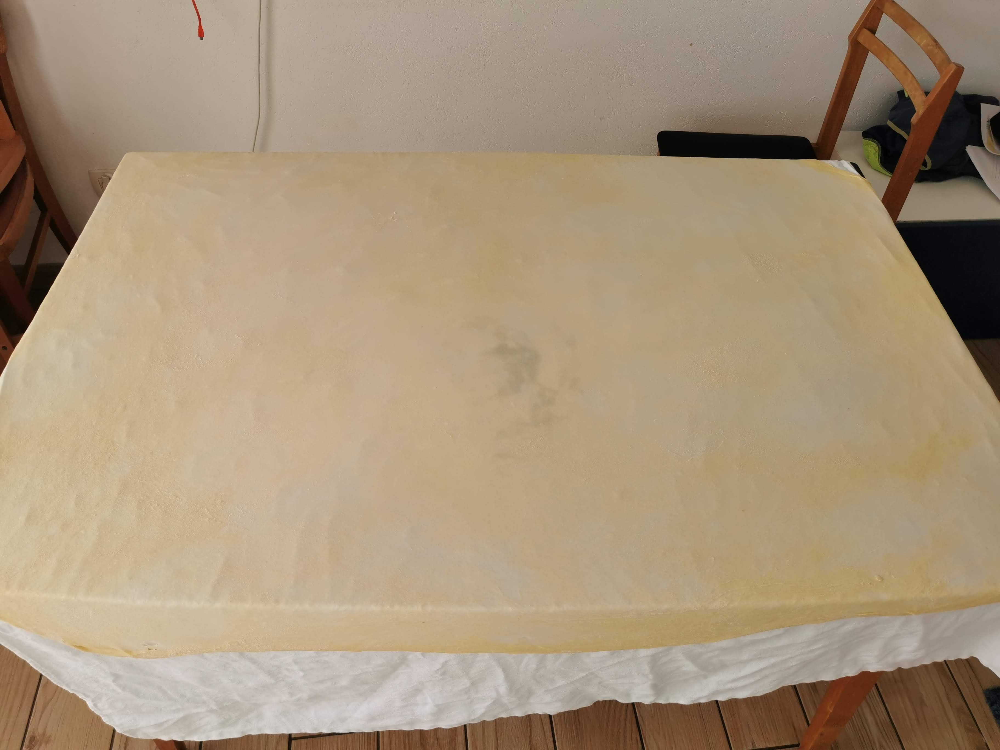
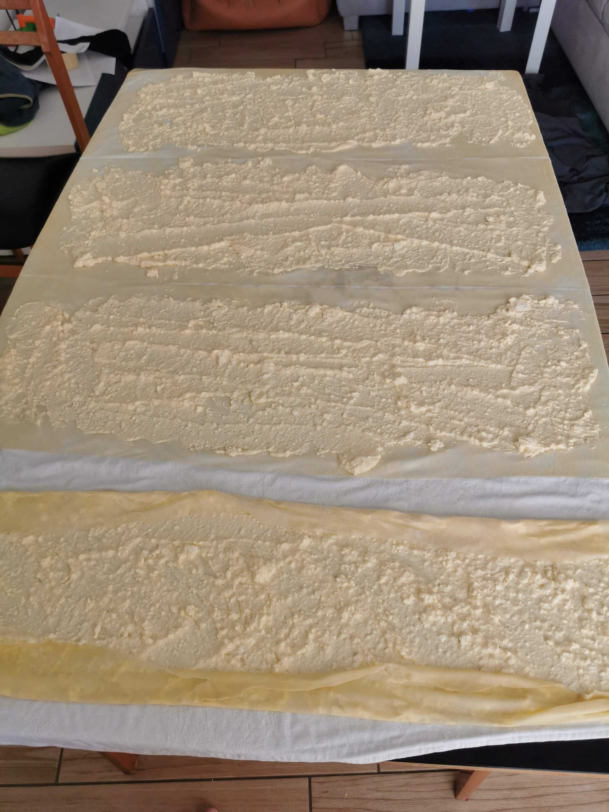
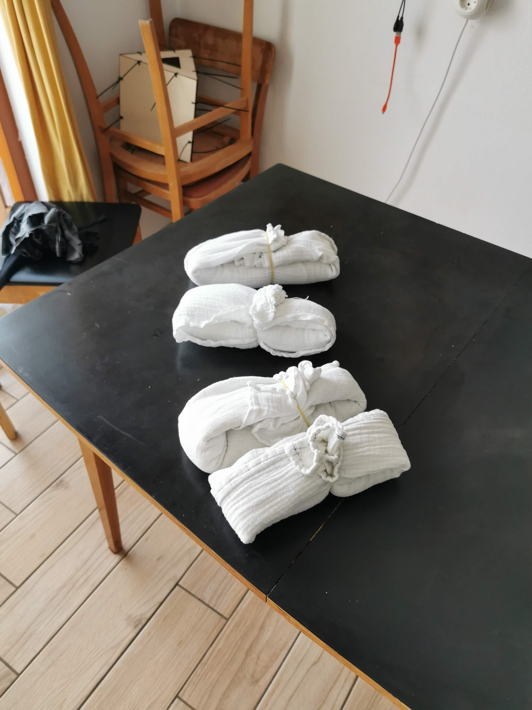

Pripraviš <a href="/recepti/vleceno-testo">vlečeno testo</a> in ga shraniš cez noč v hladilniku.

Iz beljakov narediš trd sneg.

V rumenjake in sladkor penasto vmešaš. Dodaš skuto in kislo smetano in na hitro premešaš z električnim mešalnikom.

Na roke vmesas sneg.

Na prtu razvlečeš testo. Testo iz recepta pride čez celo mizo. Označis 4 štruklje in na tanko premažeš z maso.

Z nožem za pico razrežeš testo, zaviješ štruklje v cunjo in jih kuhaš v vreli osoljeni vodi cca 30min.

Slike:

    
  

